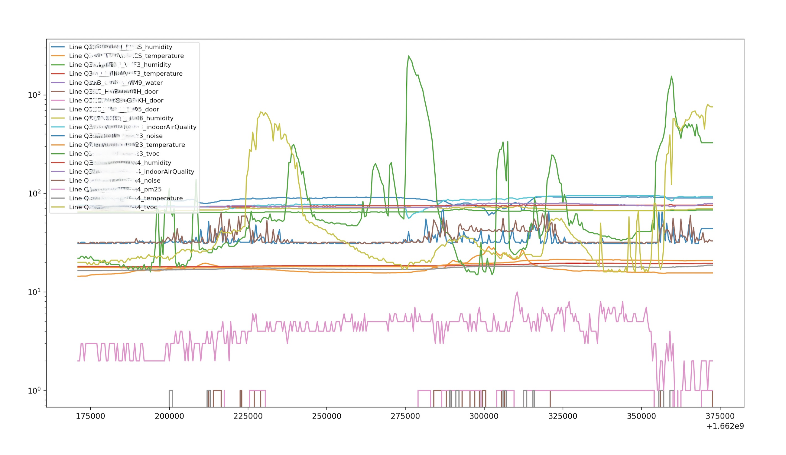

# Meraki_IoT_CSV
## Overview
The Cisco Meraki MT product family is a line of cloud managed sensor that is exceptionally simple to configure and deploy due to its integration with the Meraki dashboard and the use of BLE technology. The data generated by the MT series sensors can be consumed via a Dashboard or via an API – using an API opens up the possibility of using the data in a programmatic way, including applying Artificial Intelligence and Machine Learning (AI/ML)to the data.
Using AI/ML typically involves a preparatory stage know as Data Wrangling in order to make the data more appropriate and valuable for a variety of downstream purposes.
Some examples of Data Wrangling include:
- Processing and parsing data whereby relevant information is extracted from fresh data containing details such as numbers, ID codes etc
- Merging multiple data sources into a single dataset for analysis
- Identifying gaps in data (for example, empty cells in a spreadsheet) and either filling or deleting them
- Deleting data that’s either unnecessary or irrelevant to the project you’re working on
- Identifying extreme outliers in data and either explaining the discrepancies or removing them so that analysis can take place

Looking specifically at python, there exist a range of AI/ML and Data Wrangling tools to. These include:

- Matplotlib: Matplotlib is a Python plotting library that provides various plotting functions for working with data. It is handy for creating visualizations of data.
- Seaborn: Seaborn is a Python data visualization library that provides various plotting functions for working with data. It is beneficial for creating beautiful visualizations of data.
- Scikit-learn: Scikit-learn is a machine learning library for Python that provides a wide range of algorithms for working with data. It is particularly useful for data wrangling tasks such as feature extraction and dimensionality reduction.
- Pandas. Using the Pandas library, a Python add-on which includes the DataFrame object, and data scientists can quickly perform even more complex operations. For example, merging, joining, and transforming huge hunks of data with a single Python statement.

The purpose of this project is to take the output from the Meraki Dashboard API (provided in JSON format) and provide the sensor data in discrete, time ordered manner, in CSV and Pandas DataFrame format. 

## Usage
This tool allows for the conversion of Meraki Sensor data from the native JSON encoding format to a Comma Seperated Variable (CSV) format, and Pandas DataFrame (df) format.  
Machine Learning algorithms and other Data Wrangling tools use these formats as the imput.

The tool is launched by the following command:  
> python Meraki_IoT_CSV.py    

or for Mac:  
> python3 Meraki_IoT_CSV.py 

## Output
The tool automatically detects the available MT sensors and their associated Metrics and delivers the values in the form of a time ordered CSV file.  The sensor data is also placed in Pandas DataFrame in the same format. This means the data can easily be further wrangled by tools that use Pandas DF as a data source.

## Paramaters
The following parameters are required to be configured (examples are provided in the provided code.

### LOOKBACK
The 'LOOKBACK' value defines a timespan  which will be used to gather data over. For instance a value of 600000 will provide a value of approximately one week

### SAMPLE_TIME
The 'sampleTime' value defines the ganularity with which data is output to CSV. For instance a value of 500 means that a line of sensor reading will be provided for every 500 period. In the event that an individual sensor has not provided a reading in this timespan, the previous reading will be used. In the event that multiple readings have been provided in this timesapn, the most recent reading will be used.

### Meraki Dashboard API key
The Meraki Dashboard API key (API_KEY) is available as described [here](https://documentation.meraki.com/General_Administration/Other_Topics/Cisco_Meraki_Dashboard_API)

### ORG_ID
The Meraki ORG_ID uniquely identifies an organization assoiated with an API key (AN API key may have multiple organizations). The ORG_ID can be obtained by making a "GET Organizations" call to the meraki Dashboard API, such as from the Meraki [Documentation](https://developer.cisco.com/meraki/api-v1/#!get-organizations)

## Output

An example output CSV file is provided below, which is printed to 'results.scv' in the same directory as the script is run in (the Pandas DataFrame follows a similar format). This provides a header row with each sensor & metric combination, and an individual timestamped row for each sampleTime:

| Timestamp      | Q9EB_M7KP_VLA3_humidity |Q9EB_M7KP_VLA3_temperature| Q5MS_ISB7_PS83_water|
| ----------- | ----------- | ----------- | ----------- |
| 1657538255.0   | 59       |22.0|FALSE|
| 1657538755.0 |59       |22.1|FALSE|
|1657539255.0 | 60|22.2|FALSE|

## Matplotlib
As an example of usage of the Pandas DataFrame, the data gathered by the python script is plotted using the Matplotlib library
